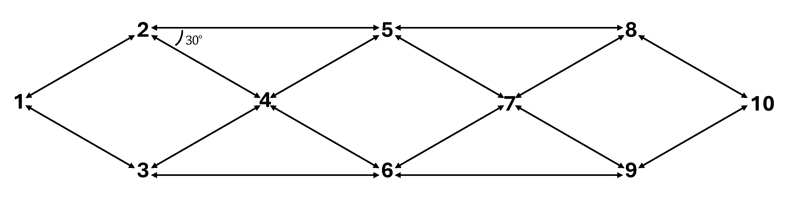

# Synthetic Sidewalk Robot Routing Dataset

This repository provides the simulation data used in the paper:

> **Robust Route Planning for Sidewalk Delivery Robots**  
> (under review in Transportation Research Part C)  

The dataset contains 180 randomized simulation instances generated on a controlled synthetic sidewalk network using **PTV VISWALK**.  
It is intended to support reproducibility and further research on robust routing and uncertainty-aware navigation for sidewalk robots.

---

## 📌 Dataset Overview

### Synthetic Network

- **Nodes:** 10  
- **Links:** 16 bidirectional sidewalk links  
  - 12 short links: 60 m  
  - 4 long links: 104 m  
- **Width:** 3 m for all links  
- **Origin–Destination:** Node 1 → Node 10  

A schematic of the network is shown below:

---

### Scenario Design

Each simulation instance is generated by combining:

#### 🚶 Pedestrian Flow Levels (on long links)

Based on HCM2010:

| Level  | Flow (ped/h) |
|--------|--------------|
| Low    | 1500 |
| Medium | 3000 |
| High   | 4500 |

Pedestrian flow on short links is set to **one third** of the corresponding long-link flow.

#### 🚧 Obstacle Levels

| Level  | Number of Obstacles |
|--------|---------------------|
| Low    | 3 |
| Medium | 6 |
| High   | 9 |

- Obstacles are squares with side length randomly between 1.0–1.4 m.
- At most one obstacle is placed on each link.
- Obstacles are placed near sidewalk edges to avoid full blockage while creating bottlenecks.

#### 🔁 Replications

- 9 categories = 3 pedestrian levels × 3 obstacle levels  
- 20 replications per category  
- Total: **180 simulation instances**

To emulate day-to-day stochastic variability, pedestrian input volumes are perturbed independently within ±20% of their category baseline.

---

## 📄 Raw Instance Files (`data/raw/`)

Each file corresponds to **one simulation instance**.

### Description

In each simulation:

- One robot is deployed on **each link**.
- Each robot travels only on its assigned link.
- The file records the trajectory and timestamps of all robots.

From each instance file, the **robot travel time on each link** can be extracted.

### File Naming

Instances are indexed from 001 to 180 and ordered by instance category:

(High demand, High obstacle) * 20 -> (High demand, Medium obstacle) * 20 -> ... -> (Low demand, Low obstacle) * 20.

---

## 📊 Input File for Robust Methods (`data/processed/traveltime_total.txt`)

This file summarizes the robot travel time on each link across all 180 instances. It serves as the direct input to the robust routing algorithms.

- **Rows:** sidewalk link, ordered as 
  
  (2,1) (2,4) (5,4) (5,7) (8,7), (8,10),
  
  (3,1) (3,4) (6,4) (6,7) (9,7), (9,10),
  
  (2,5) (5,8) (3,6) (6,9).
- **Columns:** simulation instances, indexed from 001 to 180.
- **Entry (i, j):** the robot travel time of link *i* in instance *j*.

The resulting matrix has dimension **16 × 180**. Users can directly load this file to reproduce the robust routing experiments without rerunning VISWALK.

